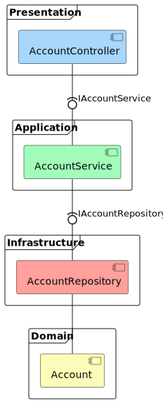

# Clean Bank
This solution was based on the _Get Started with .NET Core Clean Architecture_ Udemy course. 
Original content uses Visual Studio 2017-2019.  
This environment setup includes Visual Studio 2022, .NET 7, .NET Core MVC, Web API, SQL Server, Dependency Injection, and MediatR.
This sample adds ArchUnitNET and excludes AutoMapper.
The objective is to use a step-by-step approach to apply a Clean Architecture design pattern to a sample project.
The project uses domain, application, infrastructure, and presentation layers. 

