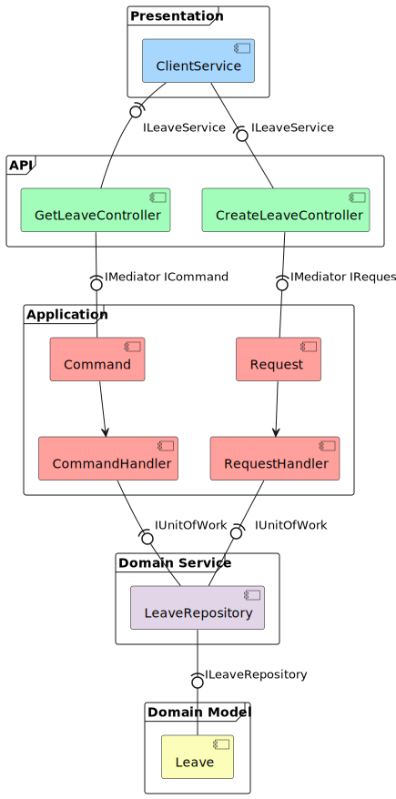

# Clean Leave
The Leave System was produced following the _ASP.NET Core - SOLID and Clean Architecture (.NET 5 and Up)_ course.
This course begins a rebuild of an existing ASP.NET Core 3.1 system towards a newer functional system using Clean Architecture with the features below. 

- SOLID 
- CLEAN Architecture 
- ASP.NET Core MVC
- .NET 7
- AutoMapper & ViewModels
- EF Code First
- Dependency Injection
- Repository Pattern
- Identity and Authentication
- Client & Server Side Validation
- Linq Queries & Lambda Expressions
- Task Asynchronous Programming
- CQRS & MediatR
- Fluent API & Validation
- Swagger & NSwag
- Unit-of-Work

